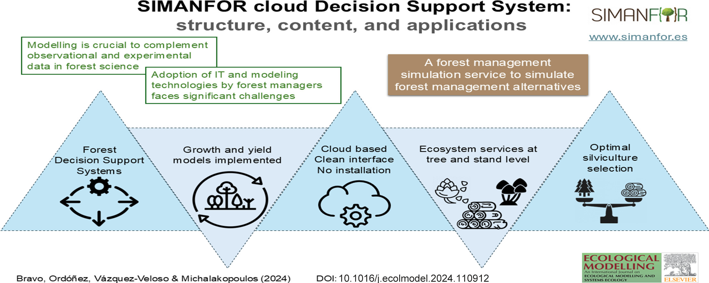

## SIMANFOR cloud DSS

*A repository with the original data, code and results of the scientific article titled:*

***SIMANFOR cloud Decision Support System: structure, content, and applications***

---

# SIMANFOR cloud Decision Support System: structure, content, and applications 

:open_file_folder: Repository DOI: 

📜 Manuscript DOI: https://doi.org/10.1016/j.ecolmodel.2024.110912 

---

## :book: Abstract

Technological progress in the last decades has driven great advances in many fields of knowledge. A wide range of tools and services are now available and constantly evolving to handle vast amounts of available data as well as the increased complexity of real-world case studies and analytical alternatives. Most sectors have embraced new methodologies to provide solutions to their problems, and the forestry sector is no exception. Important steps have been taken to update the forestry sector and introduce new large-scale experimental designs, digital tools and more extensive forestry databases. However, assimilation of this progress by forest managers remains largely pending. The more specialized technical knowledge and computing skills required to use this new generation of tools constitutes a known barrier to uptake. In this work, we present the SIMANFOR cloud-based Decision Support System service for simulating forest management alternatives. Its evolution, internal structure and potential applications are described. A case study was developed to demonstrate simulator performance under diverse management scenarios and highlight the benefits of this tool for forest managers. SIMANFOR cloud services are free and can be accessed at www.simanfor.es.

---

## :file_folder: Repository Contents

- :floppy_disk: **1_data**:
            
    - :deciduous_tree: tree and plot data obtained from [iuFOR](https://iufor.uva.es) ([Quantitative silviculture group](https://github.com/iuFOR-QuantitativeForestry)) experimental plots

- :seedling: **2_simanfor** contains inputs and outputs for all the simulations developed with [SIMANFOR](www.simanfor.es). Check out them! There are a lot of metrics unexplored in this paper :wood: :maple_leaf:

- :computer: **3_code**:

| Script Name     | Purpose               | Input                    | Output                   |
|-----------------|-----------------------|--------------------------|--------------------------|
| `0.IBERO_a_SIMANFOR.r`| Uses the original tree and plot data to adapt them to the SIMANFOR requirements| `1_data/0_raw/*` | `2_simanfor/input/*`
| `1.0_group_simanfor_results.r`| Reads all the SIMANFOR outputs, complete the calculations and organize them to be graph | `2_simanfor/output/*` | `1_data/simulation_results.RData` |
| `1.1_graph_simanfor_restuls.r` | Code to make graphs of all the interesting variables | `1_data/1_results/simulation_results.RData` | `4_figures/simulation_graphs/*` |
| `2.0_location_map.r` | Code to draw a map with the plot locations | `1_data/simulation_results.RData` | `4_figures/plot_map_Spain.png` |
| `2.1_summary_scenarios.r` | Code to summarise all the scenarios (forest management alternatives) | `2_simanfor/output/*` | `4_figures/summary_scenarios*` |

- :bar_chart: **4_figures**: graphs and figures used on the article

- :books: **5_bibliography**: recopilation of all the references used on the article

---

## :information_source: License

The content of this repository is under the [MIT license](./LICENSE).

---

## :link: About the authors:

#### Felipe Bravo Oviedo:

 \\
[ORCID](https://orcid.org/0000-0001-7348-6695) \\
[Researchgate](https://www.researchgate.net/profile/Felipe-Bravo-11) \\
[LinkedIn](https://www.linkedin.com/in/felipebravooviedo) \\
[Twitter](https://twitter.com/fbravo_SFM) \\
[UVa](https://portaldelaciencia.uva.es/investigadores/181874/detalle)

#### Aitor Vázquez Veloso:

 \\
[ORCID](https://orcid.org/0000-0003-0227-506X) \\
[Researchgate](https://www.researchgate.net/profile/Aitor_Vazquez_Veloso) \\
[LinkedIn](https://www.linkedin.com/in/aitorvazquezveloso/) \\
[Twitter](https://twitter.com/aitorvv) \\
[UVa](https://portaldelaciencia.uva.es/investigadores/178830/detalle)

#### Angel Cristóbal Ordóñez Alonso:

 \\
[ORCID](https://orcid.org/0000-0001-5354-3760) \\
[Researchgate](https://www.researchgate.net/profile/Cristobal-Ordonez-Alonso) \\
[LinkedIn](https://www.linkedin.com/in/cristobal-ordonez-b6a97244/) \\
[Twitter](https://twitter.com/OrdonezAC) \\
[UVa](https://portaldelaciencia.uva.es/investigadores/181312/detalle)

#### Spyridon Michalakopoulos

 \\
[ORCID](https://orcid.org/0000-0002-6262-8982) \\
[Researchgate](https://www.researchgate.net/profile/Spiros-Michalakopoulos) \\
[LinkedIn](https://www.linkedin.com/in/spiros-michalakopoulos/?originalSubdomain=es) \\
[Twitter](https://twitter.com/spirosmichalak) \\
[UVa](https://portaldelaciencia.uva.es/investigadores/988349/detalle)

---

[SIMANFOR cloud DSS](https://github.com/aitorvv/SIMANFOR_cloud_DSS) 
